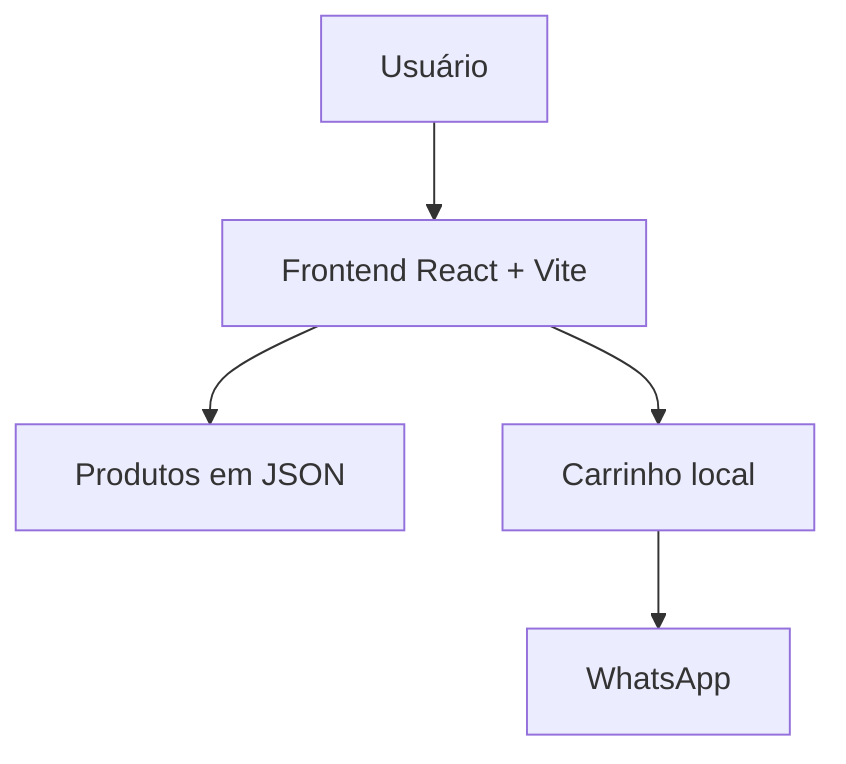
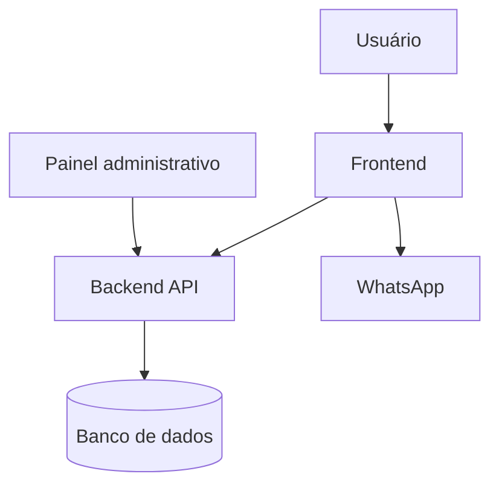

# 02. Diagrama de Arquitetura

## MVP 1

```mermaid
flowchart TD
    Usuario[Usuário]
    Frontend[Frontend React + Vite]
    Data[Produtos em JSON]
    Cart[Carrinho local]
    WA[WhatsApp]

    Usuario --> Frontend
    Frontend --> Data
    Frontend --> Cart
    Cart --> WA
```

## Futuro

```mermaid
flowchart TD
    Usuario[Usuário]
    Frontend[Frontend]
    API[Backend API]
    DB[(Banco de dados)]
    Admin[Painel administrativo]
    WA[WhatsApp]

    Usuario --> Frontend
    Frontend --> API
    API --> DB
    Admin --> API
    Frontend --> WA
```
