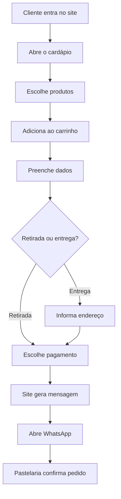

# 04. Diagrama do Fluxo de Pedido Rápido

```mermaid
flowchart TD
    A[Cliente entra no site]
    B[Abre o cardápio]
    C[Escolhe produtos]
    D[Adiciona ao carrinho]
    E[Preenche dados]
    F{Retirada ou entrega?}
    G[Informa endereço]
    H[Escolhe pagamento]
    I[Site gera mensagem]
    J[Abre WhatsApp]
    K[Pastelaria confirma pedido]

    A --> B --> C --> D --> E --> F
    F -->|Retirada| H
    F -->|Entrega| G --> H
    H --> I --> J --> K
```
