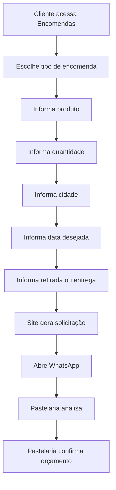

# 05. Diagrama do Fluxo de Encomenda

```mermaid
flowchart TD
    A[Cliente acessa Encomendas]
    B[Escolhe tipo de encomenda]
    C[Informa produto]
    D[Informa quantidade]
    E[Informa cidade]
    F[Informa data desejada]
    G[Informa retirada ou entrega]
    H[Site gera solicitação]
    I[Abre WhatsApp]
    J[Pastelaria analisa]
    K[Pastelaria confirma orçamento]

    A --> B --> C --> D --> E --> F --> G --> H --> I --> J --> K
```
