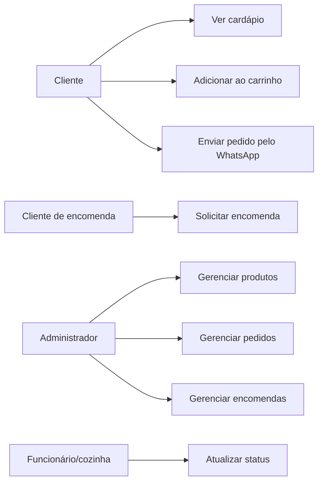

# 08. Diagrama de Casos de Uso

```mermaid
flowchart LR
    Cliente[Cliente]
    Encomenda[Cliente de encomenda]
    Admin[Administrador]
    Cozinha[Funcionário/cozinha]

    UC1[Ver cardápio]
    UC2[Adicionar ao carrinho]
    UC3[Enviar pedido pelo WhatsApp]
    UC4[Solicitar encomenda]
    UC5[Gerenciar produtos]
    UC6[Gerenciar pedidos]
    UC7[Gerenciar encomendas]
    UC8[Atualizar status]

    Cliente --> UC1
    Cliente --> UC2
    Cliente --> UC3
    Encomenda --> UC4
    Admin --> UC5
    Admin --> UC6
    Admin --> UC7
    Cozinha --> UC8
```
