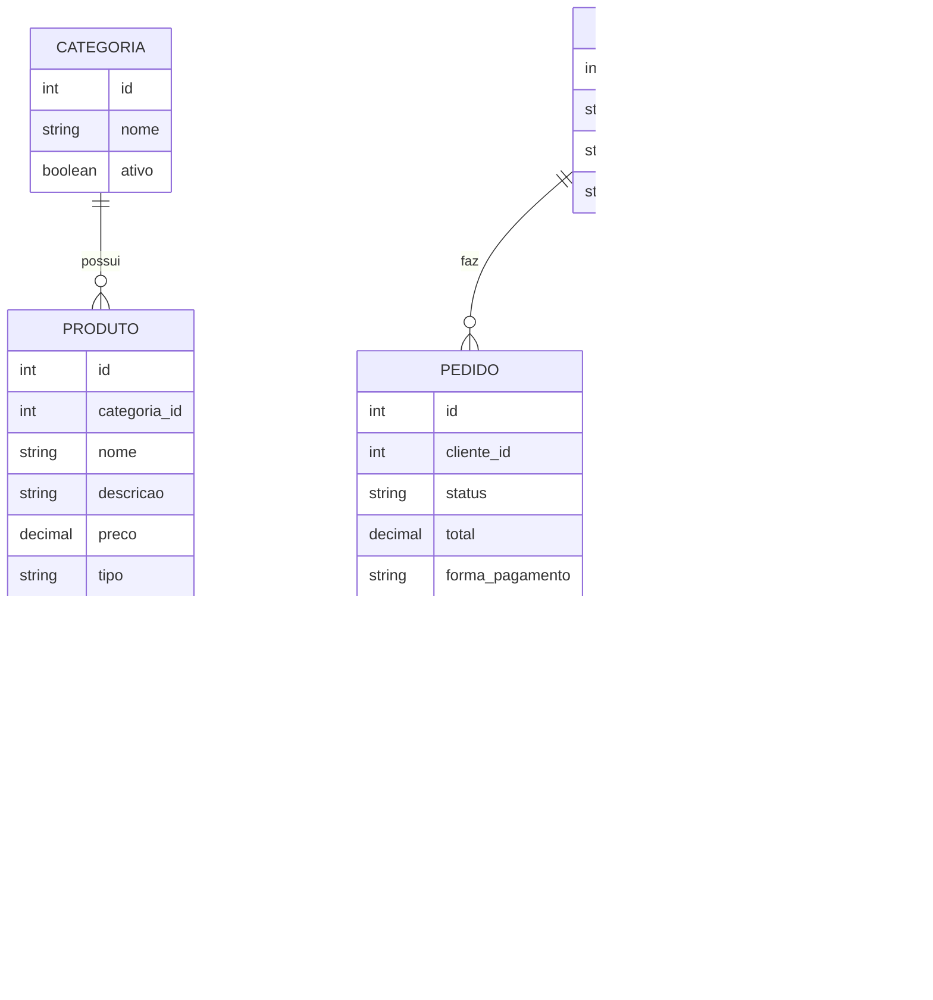

# 09. Diagrama Entidade-Relacionamento

```mermaid
erDiagram
    CATEGORIA ||--o{ PRODUTO : possui
    CLIENTE ||--o{ PEDIDO : faz
    PEDIDO ||--o{ ITEM_PEDIDO : contem
    PRODUTO ||--o{ ITEM_PEDIDO : aparece_em
    CLIENTE ||--o{ ENCOMENDA : solicita
    ENCOMENDA ||--o{ ITEM_ENCOMENDA : contem
    PRODUTO ||--o{ ITEM_ENCOMENDA : aparece_em

    CATEGORIA {
        int id
        string nome
        boolean ativo
    }

    PRODUTO {
        int id
        int categoria_id
        string nome
        string descricao
        decimal preco
        string tipo
        boolean disponivel
    }

    CLIENTE {
        int id
        string nome
        string telefone
        string cidade
    }

    PEDIDO {
        int id
        int cliente_id
        string status
        decimal total
        string forma_pagamento
    }

    ITEM_PEDIDO {
        int id
        int pedido_id
        int produto_id
        int quantidade
        decimal subtotal
    }

    ENCOMENDA {
        int id
        int cliente_id
        string tipo_encomenda
        string cidade
        date data_desejada
        string status
    }

    ITEM_ENCOMENDA {
        int id
        int encomenda_id
        int produto_id
        int quantidade
    }
```
