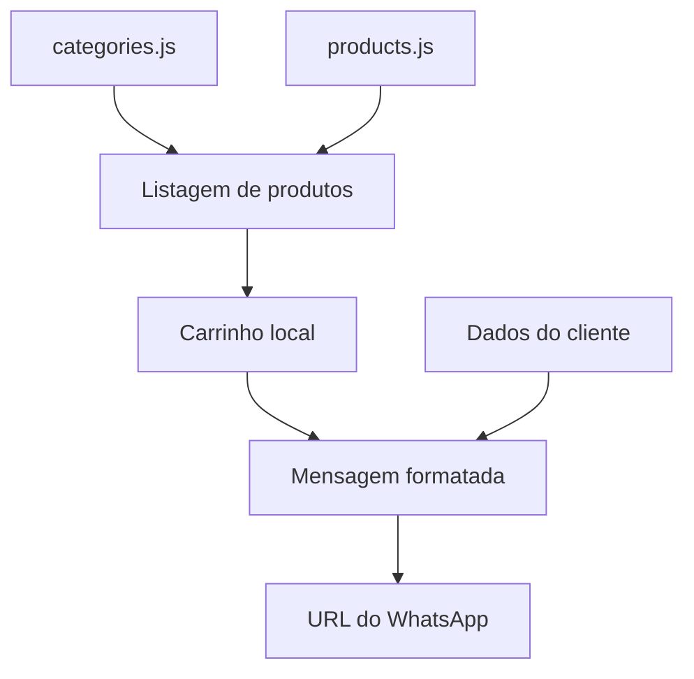

# 10. Diagrama do Modelo de Dados do MVP

```mermaid
flowchart TD
    Categories[categories.js]
    Products[products.js]
    ProductList[Listagem de produtos]
    Cart[Carrinho local]
    CustomerData[Dados do cliente]
    OrderMessage[Mensagem formatada]
    WhatsAppUrl[URL do WhatsApp]

    Categories --> ProductList
    Products --> ProductList
    ProductList --> Cart
    Cart --> OrderMessage
    CustomerData --> OrderMessage
    OrderMessage --> WhatsAppUrl
```
