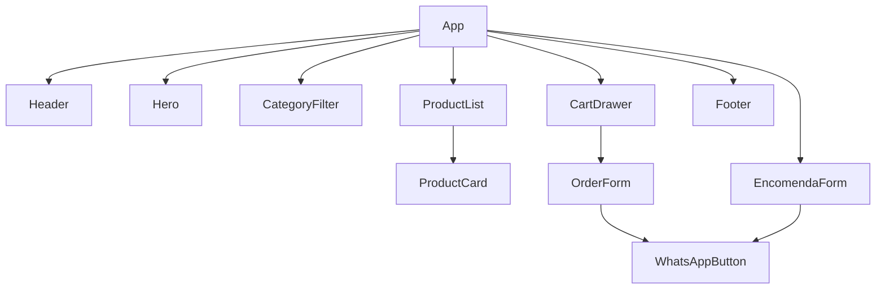

# 13. Diagrama de Componentes do Frontend

```mermaid
flowchart TD
    App[App]
    Header[Header]
    Hero[Hero]
    CategoryFilter[CategoryFilter]
    ProductList[ProductList]
    ProductCard[ProductCard]
    CartDrawer[CartDrawer]
    OrderForm[OrderForm]
    EncomendaForm[EncomendaForm]
    WhatsAppButton[WhatsAppButton]
    Footer[Footer]

    App --> Header
    App --> Hero
    App --> CategoryFilter
    App --> ProductList
    ProductList --> ProductCard
    App --> CartDrawer
    CartDrawer --> OrderForm
    App --> EncomendaForm
    OrderForm --> WhatsAppButton
    EncomendaForm --> WhatsAppButton
    App --> Footer
```
