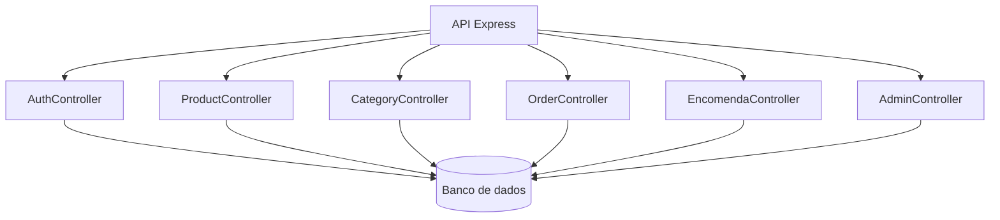

# 14. Diagrama de Componentes do Backend Futuro

```mermaid
flowchart TD
    API[API Express]
    Auth[AuthController]
    Product[ProductController]
    Category[CategoryController]
    Order[OrderController]
    Encomenda[EncomendaController]
    Admin[AdminController]
    DB[(Banco de dados)]

    API --> Auth
    API --> Product
    API --> Category
    API --> Order
    API --> Encomenda
    API --> Admin
    Auth --> DB
    Product --> DB
    Category --> DB
    Order --> DB
    Encomenda --> DB
    Admin --> DB
```
