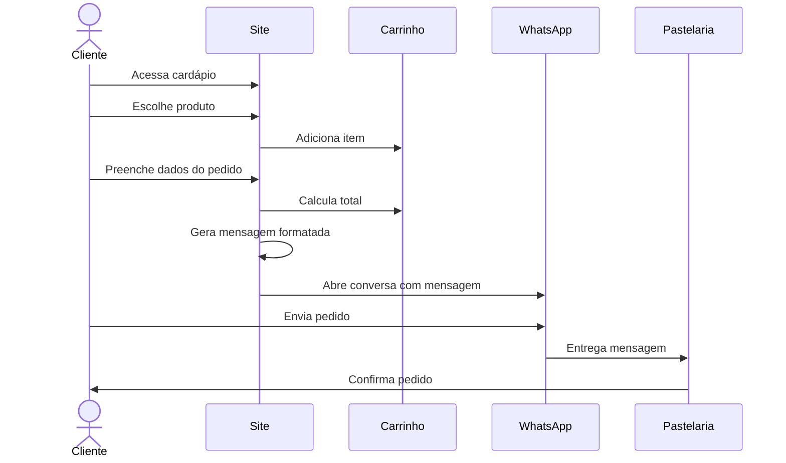

# 15. Diagrama de Sequência do Pedido via WhatsApp

```mermaid
sequenceDiagram
    actor Cliente
    participant Site
    participant Carrinho
    participant WhatsApp
    participant Pastelaria

    Cliente->>Site: Acessa cardápio
    Cliente->>Site: Escolhe produto
    Site->>Carrinho: Adiciona item
    Cliente->>Site: Preenche dados do pedido
    Site->>Carrinho: Calcula total
    Site->>Site: Gera mensagem formatada
    Site->>WhatsApp: Abre conversa com mensagem
    Cliente->>WhatsApp: Envia pedido
    WhatsApp->>Pastelaria: Entrega mensagem
    Pastelaria->>Cliente: Confirma pedido
```
