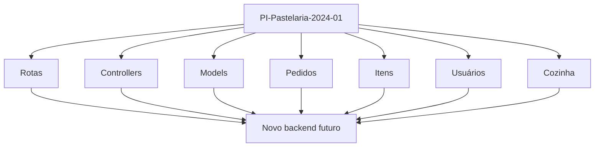

# 18. Diagrama de Reaproveitamento do Projeto Antigo

```mermaid
flowchart TD
    Antigo[PI-Pastelaria-2024-01]
    Rotas[Rotas]
    Controllers[Controllers]
    Models[Models]
    Pedidos[Pedidos]
    Itens[Itens]
    Usuarios[Usuários]
    Cozinha[Cozinha]
    Novo[Novo backend futuro]

    Antigo --> Rotas
    Antigo --> Controllers
    Antigo --> Models
    Antigo --> Pedidos
    Antigo --> Itens
    Antigo --> Usuarios
    Antigo --> Cozinha

    Rotas --> Novo
    Controllers --> Novo
    Models --> Novo
    Pedidos --> Novo
    Itens --> Novo
    Usuarios --> Novo
    Cozinha --> Novo
```
