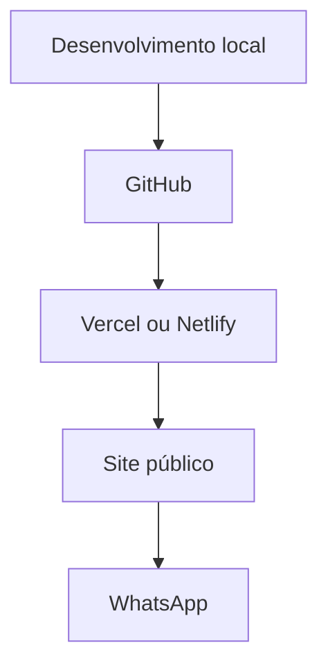
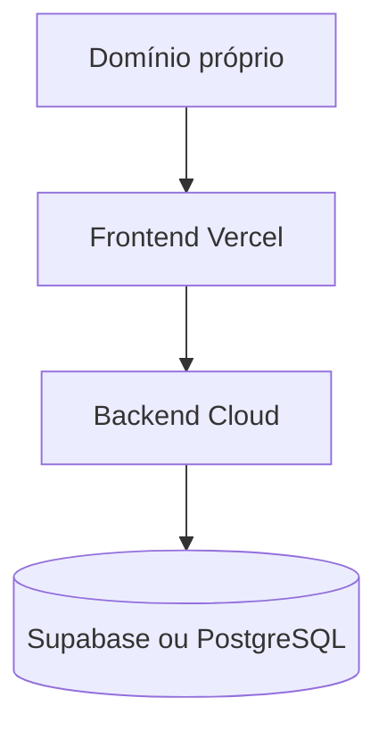

# 20. Diagrama de Deploy

## MVP 1

```mermaid
flowchart TD
    Dev[Desenvolvimento local]
    GitHub[GitHub]
    Vercel[Vercel ou Netlify]
    Site[Site público]
    WA[WhatsApp]

    Dev --> GitHub
    GitHub --> Vercel
    Vercel --> Site
    Site --> WA
```

## Futuro

```mermaid
flowchart TD
    Front[Frontend Vercel]
    API[Backend Cloud]
    DB[(Supabase ou PostgreSQL)]
    Domain[Domínio próprio]

    Domain --> Front
    Front --> API
    API --> DB
```
