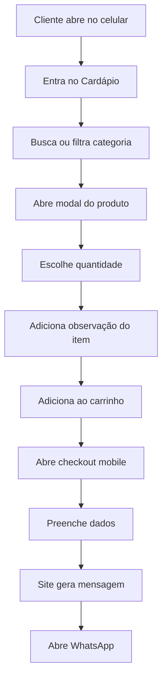

# 22. Diagrama do Fluxo Mobile de Pedido

```mermaid
flowchart TD
    A[Cliente abre no celular]
    B[Entra no Cardápio]
    C[Busca ou filtra categoria]
    D[Abre modal do produto]
    E[Escolhe quantidade]
    F[Adiciona observação do item]
    G[Adiciona ao carrinho]
    H[Abre checkout mobile]
    I[Preenche dados]
    J[Site gera mensagem]
    K[Abre WhatsApp]

    A --> B --> C --> D --> E --> F --> G --> H --> I --> J --> K
```
