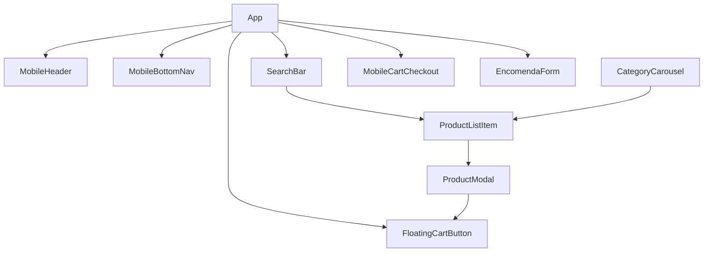

# 23. Diagrama de Componentes Mobile

```mermaid
flowchart TD
    App[App]
    MobileHeader[MobileHeader]
    MobileBottomNav[MobileBottomNav]
    SearchBar[SearchBar]
    CategoryFilter[CategoryCarousel]
    ProductListItem[ProductListItem]
    ProductModal[ProductModal]
    FloatingCartButton[FloatingCartButton]
    MobileCartCheckout[MobileCartCheckout]
    EncomendaForm[EncomendaForm]

    App --> MobileHeader
    App --> MobileBottomNav
    App --> FloatingCartButton
    App --> MobileCartCheckout
    App --> SearchBar
    SearchBar --> ProductListItem
    CategoryFilter --> ProductListItem
    ProductListItem --> ProductModal
    ProductModal --> FloatingCartButton
    App --> EncomendaForm
```
